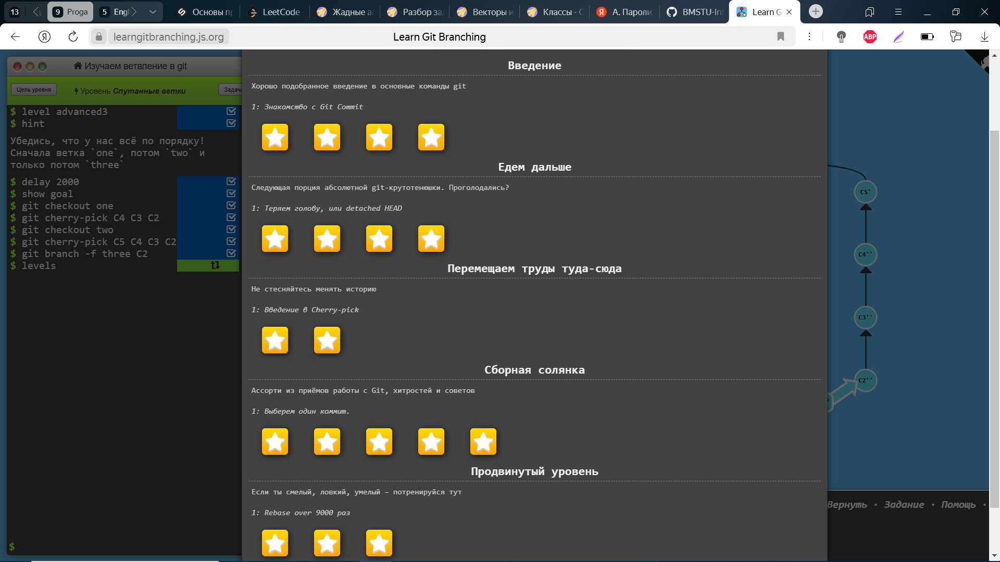

# Мини-отчет о проделанной работе на Семинаре 1  
1. Просмотрено видео об интерфейсе и тонкостях GitHub
2. **Создан свой репозиторий:** *[мой первый репозиторий](https://github.com/Bogdanagreen/First.git)*  
3. 
